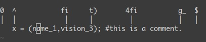
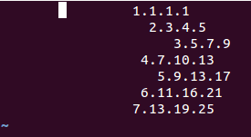
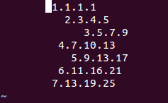

# Vim常用技巧


Vim游戏：https://vim-adventures.com/

本文参考：http://yannesposito.com/Scratch/en/blog/Learn-Vim-Progressively/

中文翻译：https://blog.csdn.net/niushuai666/article/details/7275406


Ubuntu vim doc路径 

查看vim 帮助 `man vim`   `vimtutor`    `:help usr_02.txt`    


### 文件

**新建/打开**

```
vim /tmp/file  ##不存在就是新建，存在就是打开
```

`:e /tmp/file1`  打开另一个文件

`:bn`  切换下一个文件

`:bp`  切换上一个文件


**保存**

Normal模式（Esc）

`ZZ` 保存退出

`:w`  保存

`:wq` 保存退出

`:x`  保存退出

`:q`  退出，如果已经修改不退出，会提示

`:q!` 不保留修改退出

`:w !sudo tee %`强行保存有root权限的文件退出

**另存为**

`:saveas /tmp/file2`


### 移动光标

`h←  j↓   k↑   l→`


`0`  行首

`$`  行尾

`^`  本行第一个不是blank字符的位置

`g_` 本行最后一个不是blank字符的位置

`gg` 文件第一行第一个不是blank字符，等同于1G

`G`  文件最后一行第一个不是blank字符

`nG` 到第n行第一个不是blank字符

`w`  下一个单词开头（有标点就调到标点）

`W`  下一个单词开头（忽略标点）

`e`  下一个单词末尾（忽略标点）

`E`  下一个单词末尾（有标点就调到标点）

`%`  移动到与光标当前括号匹配的括号处，向前或向后，没有匹配不移动。包括 `(`, `[`,`{` 

 


### 编辑

**插入**

`i`  在光标前插入

`I`  行首第一个不是blank字符处插入

`a`  在光标后插入

`A`  行尾最后一个不是blank字符处插入

`o`  在当前行后插入一个新行

`O`  在当前行前插入一个新行

`cw` 替换光标所在位置到单词结尾的字符（n>=1个空格算一个单词） cursor to word

`C`  替换光标所在位置到行尾的字符

`10iabc` + `Esc`	光标前重复插入 abc 10次


**剪切**

`dd`  剪切光标当前行

`ndd` 剪切光标当前行向下的n行

**复制**


`yy`  复制光标当前行，等同于`ddP`

`nyy` 复制当光标前行向下的n行

**粘贴**

`p`   粘贴到光标当前行的下一行

`P`   粘贴到光标当前行的上一行


**删除**

`dd`  删除光标所在行

`dw`  删除光标所在单词

`d$`  删除光标到行尾字符

`d0`  删除光标到行首字符

`dgg` 删除光标到文件开头字符

`dG`  删除光标到文件末尾字符

`dt,` 删除光标所在行的光标位置到下一个`,`之间所有字符


**撤销/取消撤销**

`u ` 撤销

`ctrl+r`  取消撤销


### 查找替换

**查找**

`/pattern`  向下查找

`?pattern`  向上查找

`*`  移动光标到下一个与光标处相同的单词

`#`  移动光标到上一个与光标处相同的单词

`fs`  在光标当前位置向后查找第一次出现的`s`，只能查找字符，区分大小写

`F,`  在光标当前位置向前查找第一次出现的`,`，只能查找字符，区分大小写

`3fa` 在当前行查找第三个出现的`a`，只能查找字符，区分大小写

`ts`  在光标当前位置向后查找第一次出现的`s`左边第一个字符，只能查找字符，区分大小写

`T,`  在光标当前位置向前查找第一次出现的`,`右边第一个字符，只能查找字符，区分大小写

`dt,` 删除光标所在行的光标位置到下一个`,`之间所有字符

 


**替换**

`: %s/xyz/abc/`   把光标当前行第一次遇到的xyz替换成abc

`: %s/xyz/abc/g`  全局把xyz替换成abc

`: %s/xyz/abc/g`  全局把xyz替换成abc时，逐个提示是否替换

`gU `    光标所在字符替换成大写（gu空格）

`gUU`   光标所在行全部变为大写

`gu `    光标所在字符替换成小写（gu空格）

`guu`   光标所在行全部变为小写


### 其他

`.`   重复上一个命令

`3.`  重复上一个命令3次（如果上一个命令是`3p`，这次执行`4.`是`4p`，注意不是`12p`）

`n<cmd>`   重复命令cmd n次

`%`       移动到与光标当前括号匹配的括号处，向前或向后，没有匹配不移动。包括 `(`, `[`,`{` 


**联动用法**`<start position><cmd><end position>`

`0y$`     从行首（0）复制（y）到行尾（$）没带换行符，也就是复制去掉换行符的当前行

`ye`      从当前位置复制到本单词最后一个字符

`y2/foo`  复制2个foo之间的字符串


**区域选择** `<action>a<object>`或者`<action>i<object>`

action可以是任何的命令，如 `d` (删除), `y` (拷贝), `v` (可以视模式选择)

object 可能是： `w` 一个单词， `W` 一个以空格为分隔的单词， `s` 一个句字， `p` 一个段落。也可以是一个特别的字符：`"、` `'、` `)、` `}、` `]`


假设你有一个字符串 `(map (+) ("foo"))`.而光标键在第一个 `o `的位置

- `vi"` → 会选择 `foo`.
- `va"` → 会选择 `"foo"`.
- `vi)` → 会选择 `"foo"`.
- `va)` → 会选择`("foo")`.
- `v2i)` → 会选择 `map (+) ("foo")`
- `v2a)` → 会选择 `(map (+) ("foo"))`

 


**块操作**

原始文件内容

 

- `ctrl+v`  `ctrl+d(或方向键选中块)`   `I`  `输入内容`   `Esc`      在所有被选择的行前面加上 `输入内容`

 

- `ctrl+v`  `ctrl+d(或方向键选中块)` `$` `A`  `输入内容`  `Esc`   在所有被选择的行后加上 `输入内容`

 

- `ctrl+v`  `ctrl+d(或方向键选中块)` `J`      把多行连接成一行

 

- `ctrl+v`  `ctrl+d(或方向键选中块)` `>`      向右缩进

 

- `ctrl+v`  `ctrl+d(或方向键选中块)` `>`      向左缩进

 

- `ctrl+v`  `ctrl+d(或方向键选中块)` `=`      自动缩进（去掉每行前面的空白字符）

 


**自动提示**

insert模式下输入单词开头然后

`ctrl+p`  或者  `ctrl+n`

 


**宏录制**  `qa` 操作序列 `q`, `@a`, `@@`

- `qa` 把你的操作记录在寄存器 `a。`
- 于是 `@a` 会replay被录制的宏。
- `@@` 是一个快捷键用来replay最新录制的宏

示例1：在一个只有一行且这一行只有“1”的文本中，键入如下命令

```
1
2
3
```

- `qaYp<ctrl+a>q`
  - `qa` 开始录制
  - `Yp` 复制行.
  - `ctrl+a` 增加1.
  - `q` 停止录制.
- `@a` → 在1下面写下 2
- `@@` → 在2 正面写下3
- 现在做 `100@@` 会创建新的100行，并把数据增加到 103.

 


示例2：

```
1.1.1.1
2.3.4.5
```

`qaYp<ctrl+a>ll<ctrl+a><ctrl+a>ll<ctrl+a><ctrl+a><ctrl+a>ll<ctrl+a><ctrl+a><ctrl+a><ctrl+a>q`

`@a`

`@@`

 


**分屏**

`:split` 水平分屏

`:vsplit` 垂直分屏

`ctrl`+`w`  切换到下一个分屏


`ctrl`+`-`   缩小终端

`ctrl`+`+`   放大终端