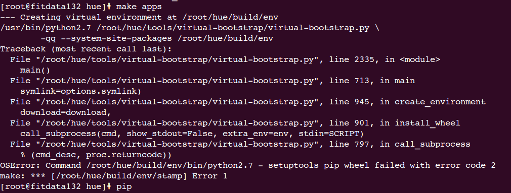
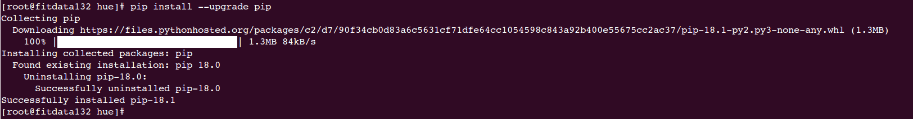
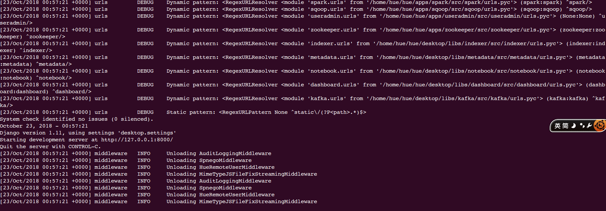
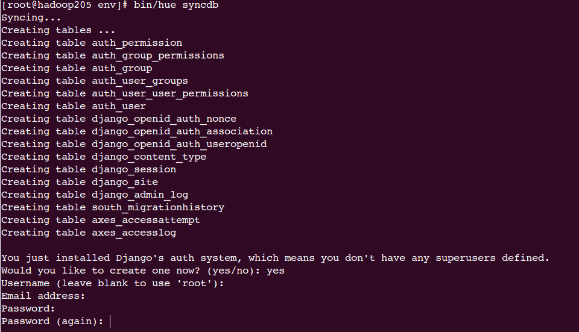
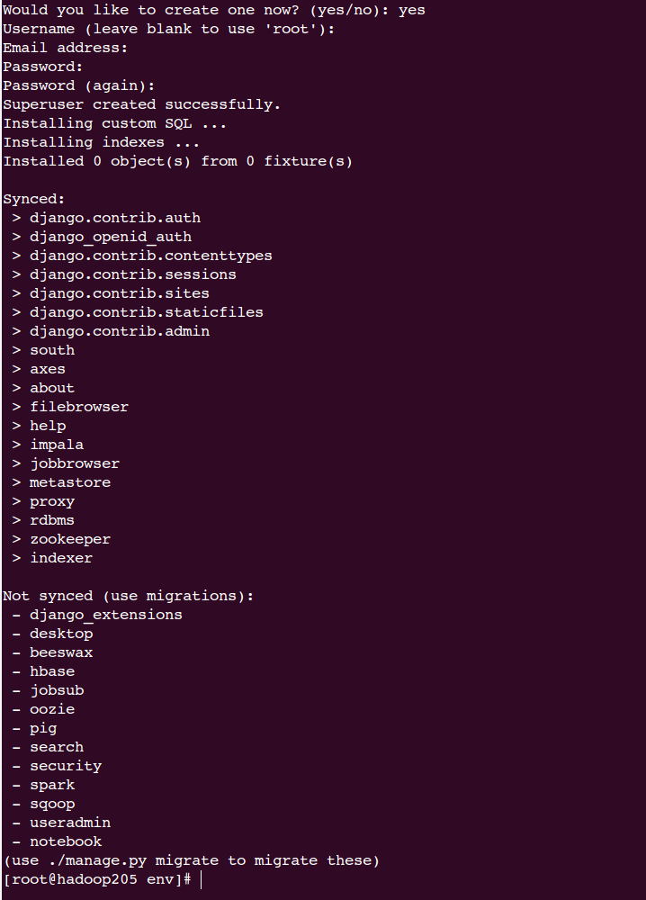
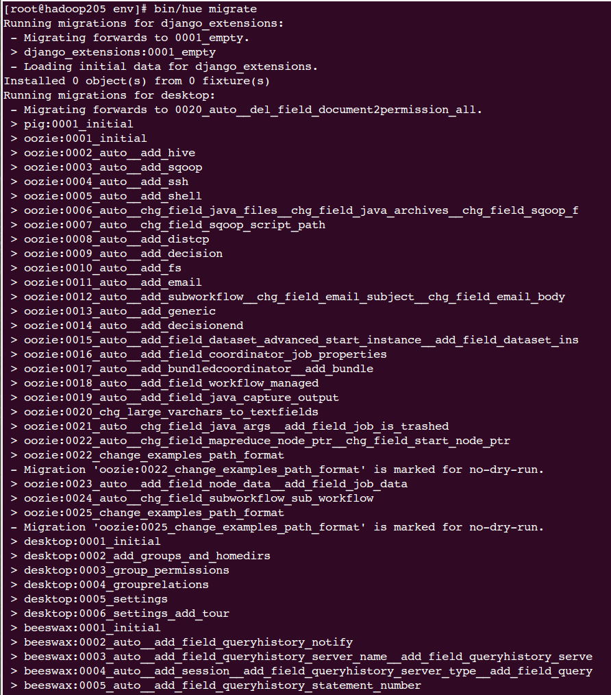
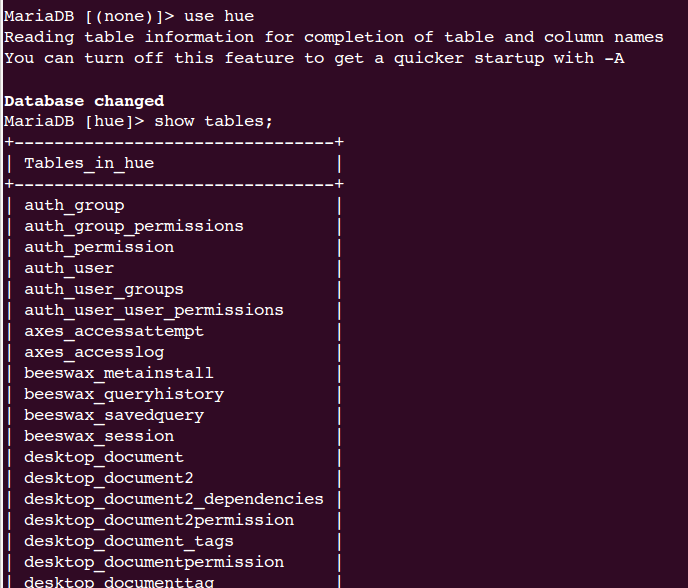

# CentOS7.2安装Hue


1、安装依赖

```
yum -y install ant asciidoc cyrus-sasl-devel cyrus-sasl-gssapi cyrus-sasl-plain gcc gcc-c++ krb5-devel libffi-devel libtidy libxml2-devel libxslt-devel make mysql mysql-devel openldap-devel python-devel sqlite-devel openssl-devel gmp-devel
```


2、安装JDK、Maven


3、下载源码编译

```
git clone https://github.com/cloudera/hue.git
cd hue
rm -rf data
mkdir -p data/hue/maven

```

临时配置maven下载包的路径到hue的文件夹

vim $MAVEN_HOME/conf/settings.xml

```
<localRepository>/home/hue/hue/data</localRepository>
```


4、编译

```
cd hue
make apps
```

报错1

 


解决办法：更新pip

```
pip install --upgrade pip
```




重新编译


5、修改配置文件

vim  desktop/conf/pseudo-distributed.ini

```
http_port=8000
is_hue_4=true
time_zone=Asia/Shanghai
```


6、编译完成后运行

```
build/env/bin/hue runserver fitdata134:8888
```





# 问题解决


### 1、hue database is locked


创建hue数据库、用户

```mysql
create database hue;
CREATE USER 'hue'@'localhost' IDENTIFIED BY 'hue';
GRANT ALL PRIVILEGES ON hue.* TO 'hue'@'localhost';
CREATE USER 'hue'@'%' IDENTIFIED BY 'hue';
GRANT ALL PRIVILEGES ON hue.* TO 'hue'@'%';
CREATE USER 'hue'@'hadoop205'IDENTIFIED BY 'hue';
GRANT ALL PRIVILEGES ON hue.* TO 'hue'@'hadoop205';
```


修改配置文件

先备份

`cd /opt/cloudera/parcels/CDH-5.7.2-1.cdh5.7.2.p0.18/lib/hue/`

`cp  desktop/conf/hue.ini   desktop/conf/hue.ini.bak`

`vim desktop/conf/hue.ini`

把最上面的 engine=sqlite3和name=/var/lib/hue/desktop.db注释掉

```
# Configuration options for specifying the Desktop Database. For more info,
  # see http://docs.djangoproject.com/en/1.4/ref/settings/#database-engine
  # ------------------------------------------------------------------------
  [[database]]
    ## engine=sqlite3
    ## name=/var/lib/hue/desktop.db
    # Database engine is typically one of:
    # postgresql_psycopg2, mysql, sqlite3 or oracle.
    #
    # Note that for sqlite3, 'name', below is a path to the filename. For other backends, it is the database name
    # Note for Oracle, options={"threaded":true} must be set in order to avoid crashes.
    # Note for Oracle, you can use the Oracle Service Name by setting "port=0" and then "name=<host>:<port>/<service_name>".
    # Note for MariaDB use the 'mysql' engine.
    engine=mysql
    host=hadoop205
    port=3306
    user=hue
    password=hue
    name=hue
    ## options={}

```


初始化数据库

```
cd  /opt/cloudera/parcels/CDH-5.7.2-1.cdh5.7.2.p0.18/lib/hue/build/env

bin/hue syncdb
bin/hue migrate
```

 

输入用户、邮箱、密码之后同步成功

 


 

 

 查看数据库中表已经创建


 


